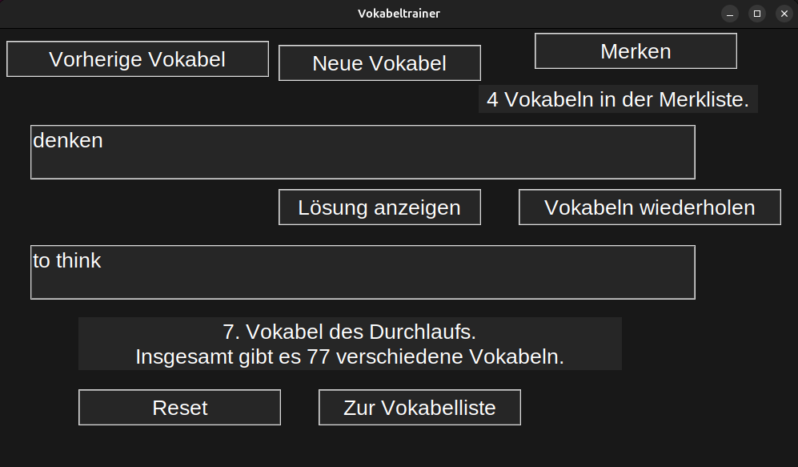

# 🧠 Learn vocabulary yourself
This is a python program to help you learn vocabulary.  

> Disclaimer:
> - The structure is quite messy, that was my first python project, so sorry :D
> - also the most of this code is in german

<details>
  <summary>📑 Table of Contents</summary>
  <ul>
    <li><a href="#highlights">🌟 Highlights</a></li>
    <li><a href="#usage">▶️ Usage</a></li>
    <li>
      <a href="#setup">🛠️ Setup</a>
      <ul>
        <li><a href="#prerequisites">Prerequisites</a></li>
        <li><a href="#installation">Installation</a></li>
      </ul>
    </li>
    <li><a href="#feedback">💭 Feedback</a></li>
  </ul>
</details>

## 🌟 Highlights <a id="highlights"></a>
- supports english, french, latin and ancient greek
- freely add your own vocabs by editing the database

## ▶️ Usage <a id="usage"></a>
> a detailed guide with all functionality in german is in the `Anleitung.txt`



1. Choose your desired language to learn
2. You can either:
   1. show next vocab
   2. show previous vocab
   3. remember current vocab
   4. revise remembered vocabs
   5. reset
   6. see the whole lsit of vocabs

## 🛠️ Setup <a id="setup"></a>
This little guide will guide you to setup this programm on your local machine.
> tested on windows and linux ubuntu 

### Prerequisites <a id="prerequisites"></a>
Before installing or using this project, make sure the following are available on your system:

- python>=3.9
- pip (usually included with Python)
- git (optional, if cloning the repository)

> It is recommended to have Python in your `PATH`, otherwise you always have to write the full path to your local `python.exe`. Linux/MacOS have python pre-installed and in `PATH` by default, and on windows you have to [install python](http://python.org/downloads/) and [put it in your path](https://phoenixnap.com/kb/add-python-to-path) (if not done automatically at installation)

### Installation <a id="installation"></a>
If you have fullfilled all the requirements listed above, you can either:
1. build yourself with these commands:
```bash
git clone https://github.com/Gazoooo/vocabTrainer.git # clone repo
cd vocabTrainer # navigate to project directory
pip install -r requirements.txt # install the necessary packages
python Scripts/main.py # run the script
```
2. (Only for windows) Run the `installer/install.bat` file to automatically install python in project's directory. After this, you can simpy run `execute.py` to run the Script.

## 💭 Feedback <a id="feedback"></a>
I created this project myself and really appreciate any feedback!  
If you have questions, find a bug, or have suggestions for improvement, feel free to reach out or open an issue.

You can contact me [via mail](mailto:gustav@otzen.de).


